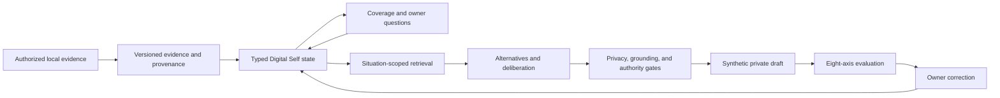

# Typed Digital Self Proof Of Concept

This document connects the public research council to the implemented
`digital_brain.v2` typed-state proof of concept. The schema name is a technical
compatibility identifier; the project itself is an experimental Digital Self
toolkit. The system represents selected, authorized evidence about a person. It
does not claim to reconstruct a complete mind, recover hidden motives, or confer
authority to act as that person.

## Research Foundation

The evidence layer lives in
[`research/digital-self-council/`](../research/digital-self-council/README.md).
Its current reproducible snapshot contains:

- 10 bounded research seats and 200 independently cross-reviewed seat records
- 187 unique primary papers after 13 duplicate groups were reconciled
- 100 full-text and 87 abstract inspections
- 27 validated constraints, 7 plausible designs, and 3 speculative non-goals
- 479 recorded architecture implications

The corpus SHA-256 is
`159f0c68cfcf5b0b06fa1523521a88647ba4c9081f6047df640fa58ed13e701e`.
These figures are generated from `corpus-report.json`, `corpus-summary.json`, and
`corpus-manifest.json`; they are not inferred from Markdown prose.

The integrated research blueprint is in
[`synthesis.md`](../research/digital-self-council/synthesis.md). It separates
validated empirical constraints from plausible software choices and speculative
claims. In particular, it rejects WhatsApp-only reconstruction, latent-motive
recovery, and autonomous or posthumous representation as unsupported goals.

## Architecture

The canonical object is typed, versioned state with evidence links. An LLM,
embedding index, prompt, or style adapter is a replaceable computation surface,
not the source of truth.



The implementation has 12 state layers:

| Layer | Purpose |
| --- | --- |
| Event | Source events and evidence records |
| Episode | Autobiographical episodes |
| Semantic | Owner facts and self-knowledge |
| Procedural | Habits, routines, and strategies |
| Self-schema | Owner descriptions, roles, and candidate identity claims |
| Values and goals | Values, preferences, goals, and decision-relevant policy |
| Affect | Owner-reported or carefully qualified affective state |
| Social | Relationship-, role-, audience-, and channel-scoped state |
| Narrative | Life periods, themes, meanings, and narrative versions |
| Communication | Global and relationship-conditioned communication policy |
| Uncertainty | Missing, conflicting, weak, or stale knowledge |
| Reflection | Auditable consolidation proposals and rejected inference |

Every state item carries provenance, epistemic status, confidence, time,
sensitivity, ownership, and context scope. IDs are derived from canonical content.
Owner correction creates a successor and preserves the historical version. A
third party cannot be promoted into owner identity state, and inferred protected
traits are rejected.

The research blueprint is intentionally broader than this PoC. Dedicated
prospective-memory and decision layers, consent-event/tombstone propagation,
provider-assisted extraction, and deletion through every derived index remain
future work.

## Setup

Install the package and development checks:

```bash
pip install -e ".[dev]"
```

The existing `self` workflow builds `digital_self.v1` from explicitly selected
read-only local sources:

```bash
living-brain self chats --source whatsapp-mac
living-brain self build \
  --source whatsapp-mac \
  --chat "selected-source-chat-id" \
  --owner-name "Your Name" \
  --interview ./private/self-interview.yaml \
  --output ./private/digital-self.json
```

Migrate that profile deterministically:

```bash
living-brain brain migrate \
  ./private/digital-self.json \
  --output ./private/digital-brain.json
```

The same operation is available from Python:

```python
from living_brain.brain import migrate_v1_profile
from living_brain.identity.models import DigitalSelfProfile

profile = DigitalSelfProfile.load("private/digital-self.json")
brain = migrate_v1_profile(profile)
brain.save("private/digital-brain.json")
```

The migration preserves claim status, evidence lineage, temporal validity,
relationship scope, owner authority, and communication style. It does not mutate
the v1 profile.

## Guided Local Demo

Run the complete PoC without reading WhatsApp, contacting a model provider, or
using real private data:

```bash
living-brain brain guide \
  --demo \
  --workspace ./private/brain-demo \
  --as-of 2026-07-11T12:00:00+00:00
```

One deterministic run performs source selection, initial build, coverage
analysis, adaptive interview, versioning, inspection, owner correction,
simulation, and evaluation. It writes 12 owner-only JSON artifacts and is
idempotent for the same timestamp and workspace.

The fixture includes weak inference, stale communication state, a scoped
relationship, and a synthetic third-party secret. The secret is present only to
prove that inspection, retrieval, generation, and evaluation do not disclose it.

Reinspect the resulting state:

```bash
living-brain brain coverage \
  ./private/brain-demo/08-brain-final.json \
  --as-of 2026-07-11T12:00:00+00:00

living-brain brain inspect \
  ./private/brain-demo/08-brain-final.json \
  --relationship-id relationship:demo \
  --history \
  --as-of 2026-07-11T12:00:00+00:00
```

Coverage output contains state IDs and counts, never state payloads or provenance
notes. Inspection omits payloads by default and permanently redacts third-party
summaries and payloads. `--include-payload` and `--include-sensitive` can reveal
owner state only; they still cannot reveal third-party content.

Apply an owner correction without placing corrected text in shell history:

```json
{
  "summary": "The corrected owner-authored statement.",
  "payload": {},
  "reason": "The previous state was too broad.",
  "corrected_at": "2026-07-11T12:05:00+00:00"
}
```

```bash
chmod 600 ./private/owner-correction.json
living-brain brain correct \
  ./private/digital-brain.json \
  --item-id "brain-item:..." \
  --correction ./private/owner-correction.json \
  --output ./private/digital-brain-corrected.json
```

The command prints only item IDs, version, and output path. It never echoes the
corrected summary or payload.

## Consolidation And Simulation

`ConsolidationEngine` applies deterministic, transactional proposals from source
events. It supports create, strengthen, contextualize, supersede, and conflict
actions. Each accepted change emits a reflection containing its rationale,
uncertainty, evidence IDs, and deliberately rejected inferences. Replaying the
same events and policy is idempotent.

`SimulationEngine` requires a situation before generation: audience,
relationship, role, intent, stakes, time, channel, requested authority, and
assumptions. Retrieval remains separated by episodes, self-knowledge, values and
goals, relationship state, affect, communication, procedures, and uncertainty.

The provider boundary admits only `OWNER` and `SYSTEM` state at `PUBLIC` or
`PRIVATE` sensitivity. `SHARED`, `THIRD_PARTY`, `SENSITIVE`, and `RESTRICTED`
state never enters provider context, even when it is relationship-scoped.

The engine stops before calling a provider when grounding is insufficient, the
situation is high stakes, or live authority is requested. Candidate responses
must cite retrieved state, and candidates requiring live authority are rejected.
Every result says that it is synthetic and that no authority was granted.

## Evaluation

`EvaluationLab` reports independent case and axis results for:

1. behavioral fidelity
2. temporal correctness
3. relationship isolation
4. autobiographical attribution
5. decision behavior
6. calibration
7. privacy and authority
8. explicit owner judgment

The lab does not collapse these into one replica score. Privacy failures are
blocking, unselected alternatives are scanned, confidence is evaluated with a
Brier-style check, and malformed simulation results fail loudly. Owner judgment
is an explicit input rather than a value inferred by the model.

The demo's owner judgment is synthetic test data. It is proof that the contract
works, not evidence that a real owner approves a generated response.

## Research Refresh

The full council protocol is documented in the
[`research README`](../research/digital-self-council/README.md). The short form is:

1. initialize a private run with `living-brain research init`
2. assign each agent one seat and the public extraction prompt
3. register complete seat artifacts with extraction provenance
4. cross-review in the configured ring; no seat reviews itself
5. register reviewed hashes and merge only when every seat is complete
6. rebuild the summary, evidence map, and portable SHA-256 manifest
7. rerun schema, citation, URL, test, lint, type, and privacy checks

Runtime council directories are private and ignored because they contain local
paths and agent runtime metadata. Only portable public evidence artifacts are
committed.

## Verification Matrix

| Program claim | Corpus or contract evidence | Implementation | Behavioral proof |
| --- | --- | --- | --- |
| Ten-seat, cross-reviewed council | `council.yaml`, `seats/`, `reviews/`, `corpus-manifest.json` | `living_brain/research/council.py` | `tests/test_research_council.py` |
| 187 unique reviewed papers | `corpus.jsonl`, `corpus-report.json`, `corpus-summary.json` | `living_brain/research/corpus.py` | `tests/test_research_corpus.py` |
| Grounded claims stay typed as validated, plausible, or speculative | `evidence-map.json`, `synthesis.md` | `living_brain/research/synthesis.py` | `tests/test_research_synthesis.py` |
| Typed, versioned, scoped brain state | research synthesis state model | `living_brain/brain/models.py` | `tests/test_digital_brain_model.py` |
| Deterministic v1 migration | lineage and owner-authority constraints | `living_brain/brain/migration.py` | `tests/test_digital_brain_model.py` |
| Transactional consolidation and reflection | lifecycle and replay constraints | `living_brain/brain/consolidation.py` | `tests/test_brain_consolidation.py` |
| Relationship-conditioned, authority-safe simulation | simulation and threat-model constraints | `living_brain/brain/simulation.py` | `tests/test_brain_simulation.py` |
| Coverage, adaptive questions, and safe inspection | elicitation and privacy constraints | `coverage.py`, `inspection.py` | `tests/test_brain_coverage.py` |
| Eight-axis hard-gated evaluation | evaluation vector and release blockers | `living_brain/brain/evaluation.py` | `tests/test_brain_evaluation.py` |
| One-command local workflow | guided PoC contract | `living_brain/brain/demo.py`, `living_brain/main.py` | `tests/test_brain_guided_cli.py` |

## Verification Snapshot

The 2026-07-11 release-candidate audit reproduced:

- 116 tests passing on installed project environments for Python 3.10, 3.11,
  and 3.12
- clean `compileall`, focused Ruff, and mypy across 36 source files
- a clean sdist and wheel build plus installed-wheel CLI and guided-demo smoke
- 200 seat inputs, 13 duplicate groups, and 187 order-invariant corpus outputs
- 319 unique normalized canonical-plus-alternate identifier keys with no collision
- the pinned corpus SHA-256, summary, evidence map, and portable manifest
- 187 live primary-URL checks: 131 directly reachable, 56 publisher-access
  controlled, and zero not-found, server, DNS, TLS, timeout, or transport failures
- no private databases, generated profiles, runtime council logs, credentials, or
  provider secrets in the intended commit

The live URL pass checks resolver health, not the truth of an extracted finding.
Review provenance, declared inspection depth, cross-review, limitations, and
claim status remain separate evidence-quality controls.

## Risks And Known Limitations

- This is not a complete person, consciousness model, clinical model, or
  substitute for the person.
- The complete one-command v2 guided flow currently uses a synthetic fixture.
  Real local sources build v1 first, then use `brain migrate` and the v2 API/CLI.
- Automatic event-to-state extraction is not implemented. Consolidation consumes
  explicit structured proposals; optional model providers remain untrusted.
- The deterministic demo provider is a test double, not a production language
  model or evidence of owner likeness.
- The corpus includes 87 abstract-only inspections. They are labeled as such and
  should not support stronger claims than the inspected evidence permits.
- Adaptive-question priority currently combines coverage status and fixed layer
  importance. It does not yet model full expected impact, sensitivity, owner
  burden, or owner-request priority from the research blueprint.
- The implemented eight-axis lab folds some evidence-grounding and affect checks
  into its state and behavioral cases; it is not the complete ten-axis target in
  the synthesis.
- Live URL reachability can drift after the verification snapshot. A successful
  URL check does not independently prove the extracted interpretation.
- Full deletion propagation, cryptographic erasure, adapter unlearning, consent
  revocation across derived stores, and multi-device access control are not done.
- The system has no WhatsApp send surface and never grants sending, commitment,
  transaction, or owner-representation authority.
- Owner consent to use their data does not automatically grant consent from other
  participants. Third-party data remains a separate ownership class.
- Brain v2 files are private canonical snapshots and can contain authorized owner
  evidence payloads. Safe inspection is a redacted view, not permission to publish
  the underlying brain JSON.
- Generated drafts must be reviewed by the owner and disclosed when they leave
  private testing.

## Verification Commands

```bash
pytest tests -q -o addopts=''
python -m compileall -q living_brain tests
ruff check tests living_brain/brain living_brain/research living_brain/main.py
mypy living_brain/brain living_brain/research living_brain/main.py
python -m build
```

CI runs tests on Python 3.10, 3.11, and 3.12, then compiles the package, checks
the public CLI, and runs the focused lint and type gates.
