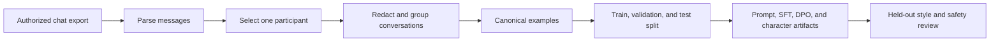
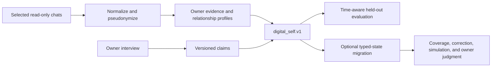

# Digital Self Explainer

Digital Self is an experimental toolkit for turning authorized WhatsApp data
into inspectable representations of one person. It supports two different
questions:

1. **Mini-Me:** How does this person tend to write in one conversational setting?
2. **Digital Self:** What owner-supported patterns remain useful across several
   relationships and points in time?

Those questions need different data, outputs, and tests. The project keeps the
two paths separate instead of treating every message as evidence of one fixed
personality.

## Scope And Naming

**Digital Self** is the project umbrella. **Mini-Me** is the friendly name for
the narrow, single-person style workflow. The command remains `living-brain`
because renaming an installed CLI would break existing scripts. Internal schemas
such as `digital_brain.v2` also remain technical compatibility identifiers.

The outputs are models and datasets, not consciousness, hidden motives, or a
complete human replica. WhatsApp shows only behavior in selected conversations.
Silence, offline life, unselected relationships, and changes outside the data
remain unknown.

## The Two Approaches

| | Mini-Me | Multi-chat Digital Self |
| --- | --- | --- |
| Input | One selected participant's messages, often from one exported chat | Owner messages from several explicitly selected local chats, plus an optional owner interview |
| Main signal | Wording, length, punctuation, emoji, code-switching, reply patterns | Evidence-backed claims, time, relationship differences, communication policy, memory, uncertainty |
| Output | Prompt/style cards and optional SFT or preference-training data | `digital_self.v1`, held-out evaluation suite, and optional `digital_brain.v2` typed state |
| Honest claim | “Writes more like this person in this setting” | “Uses selected evidence to model some owner-supported patterns” |
| Main risk | Memorizing phrases or copying one relationship too broadly | Flattening contradictions, mistaking another person's words for owner identity, or using stale claims |

## Approach A: Build A Mini-Me

### 1. Extract

`living-brain parse` reads a WhatsApp text export, recognizes supported
timestamps, separates participant messages from system events, and preserves
conversation boundaries. In the workbench, the owner chooses one participant
and confirms consent before generation begins.

For each target reply, the builder keeps up to the configured number of prior
turns as context. Third-party text is replaced with
`[third-party message withheld]` by default. Basic PII redaction runs on both
context and the target reply.

### 2. Convert

Each usable reply becomes one canonical example with:

- a stable hash ID and source location
- prior turns as context and the selected person's reply as the target
- privacy labels and redaction reasons
- a conversation-level split group
- quality fields such as context presence, character count, synthetic status,
  and drop reasons

Whole conversation groups, rather than individual messages, are assigned to
train, validation, or test. This reduces leakage from nearly identical adjacent
turns. Imports with fewer than three conversation groups intentionally remain
train-only; the tool does not pretend that a meaningful holdout exists.

### 3. Turn Examples Into Usable Artifacts

The workbench writes:

| Artifact | What it becomes |
| --- | --- |
| `summary.json` | Counts, participant information, and build metadata |
| `canonical_examples.jsonl` | Auditable source rows before framework-specific conversion |
| `sft_alpaca.jsonl` | Instruction/input/output rows for supervised fine-tuning |
| `sft_messages.jsonl` | Chat-message rows for supervised fine-tuning |
| `dpo_trl.jsonl` | TRL-style chosen/rejected preference pairs |
| `dpo_openai.jsonl` | OpenAI-format preference pairs |
| `eval.jsonl` | Validation/test prompts, real references, and a review rubric |
| `style_capsule.json` | Aggregate style metrics, rules, and a drafting prompt |
| `canonical_character.json` | Framework-neutral character/profile description |
| `character_card_v2.json` | Character Card v2 representation |
| `persona.md` | Human-readable aggregate persona summary |
| `recommendation.md` | Data-volume-aware recommendation for prompt, RAG, SFT, or preference tuning |

SFT rows use observed replies only. DPO rows use the observed reply as the
chosen answer and a clearly labeled synthetic mutation as the rejected answer.
Synthetic negatives are not passed off as real messages.

### 4. Train Only When The Data Supports It

The default progression is prompt card first, then retrieval, then optional
QLoRA SFT when there are enough clean examples. Preference tuning makes sense
only when chosen/rejected or approval labels are meaningful. A model trained on
one chat should remain relationship-scoped unless broader evidence shows the
same behavior elsewhere.

### 5. Grade The Mini-Me

`eval.jsonl` keeps validation and test replies out of training and supplies this
rubric:

- style match: 1-5
- context fit: 1-5
- privacy safety: pass/fail
- no invented facts: pass/fail
- memorization: pass/fail

The numeric style scores are review aids, not proof of identity. Privacy,
invention, or memorization failures should block release even when the writing
sounds convincing.

## Approach B: Build A Multi-Chat Digital Self

### 1. Select And Extract

`living-brain self chats` lists sources without printing message bodies. The
owner then passes explicit chat IDs to `living-brain self build`; `--all-chats`
is available but intentionally requires a deliberate choice.

WhatsApp for Mac is opened through SQLite read-only mode. `wacli` is supported
as a third-party linked-device mirror, not as an official API or guaranteed
complete history. Messages are normalized into source, chat, relationship,
timestamp, owner/other, type, and content-hash fields.

### 2. Separate Evidence From Identity

Owner message bodies are not copied into the portable profile. The profile keeps
stable content hashes, aggregate style metrics, source metadata, and provenance.
Third-party text is excluded by default and, even when explicitly included for
context, cannot support an owner identity claim.

The builder combines two evidence types:

- **Observed behavior:** candidate communication patterns derived from the
  training split, marked as candidates rather than facts.
- **Owner self-report:** interview answers with completion time and explicit
  owner provenance.

Claims carry status, confidence, temporal validity, and evidence links.
Relationship-specific styles remain scoped to pseudonymous relationship IDs so
one contact's conversational pattern does not become the global average.

### 3. Convert And Version

The first canonical output is `digital_self.v1`. It contains evidence records,
claims, relationship profiles, communication style, source summaries, and
metadata. A deterministic migration can then map this profile into
`digital_brain.v2`, the internal typed-state schema used by the PoC.

That schema has 12 layers: event, episode, semantic, procedural, self-schema,
values and goals, affect, social, narrative, communication, uncertainty, and
reflection. Every item carries provenance, epistemic status, confidence, time,
sensitivity, ownership, and context scope. Owner correction creates a successor
instead of silently rewriting history.

### 4. Evaluate The Digital Self

The `self evaluate` workflow creates private held-out reply and interview-retest
rows. It defines three configurations for comparison: generic baseline, profile
only, and profile plus retrieval. Coverage checks include latest preference,
supersession, contradiction, grounding, abstention, and relationship leakage.
The separate summary contains counts and tags but no private prompt or response
text.

The typed-state evaluator keeps eight axes separate:

1. behavioral fidelity
2. temporal correctness
3. relationship isolation
4. autobiographical attribution
5. decision behavior
6. confidence calibration
7. privacy and authority
8. explicit owner judgment

There is no single “how much of the person did we clone?” score. Privacy is a
hard gate, confidence is checked against correctness, and owner approval is an
input supplied by the owner rather than inferred by a model.

## The 12 Guided-Run Artifacts

`living-brain brain guide --demo` is a deterministic synthetic walkthrough of
the typed-state path. It reads no WhatsApp data and calls no external model. The
12 files are stages and receipts, not 12 different models or 12 quality grades.

| # | File | What it proves or records |
| --- | --- | --- |
| 1 | `01-source-selection.json` | Which synthetic source was selected and that no real private data or external access was used |
| 2 | `02-brain-initial.json` | Initial typed state, including weak, stale, and scoped evidence used to exercise safeguards |
| 3 | `03-coverage-before.json` | Missing or weak layers and the next owner questions before enrichment |
| 4 | `04-adaptive-interview.json` | Questions selected from those gaps and the synthetic answers supplied |
| 5 | `05-brain-interviewed.json` | New version after interview-backed state is added |
| 6 | `06-inspection-before-correction.json` | Redacted inspection view used to find stale, uncertain, or conflicting state |
| 7 | `07-correction.json` | Receipt linking the superseded item to its owner-corrected successor |
| 8 | `08-brain-final.json` | Final versioned state after correction |
| 9 | `09-coverage-after.json` | Coverage after the interview and correction, for before/after comparison |
| 10 | `10-simulation.json` | Situation, grounded alternatives, selected private draft, assumptions, citations, confidence, and authority denial |
| 11 | `11-evaluation.json` | Results for all eight independent evaluation axes and the overall hard-gated pass state |
| 12 | `12-run-summary.json` | Run status, stage list, artifact paths, version, question count, and evaluation result |

The demo's owner answer and owner-judgment score are synthetic fixtures. They
verify the software contract; they do not demonstrate that a real person was
modeled accurately.

## What “Good” Looks Like

A credible experiment should be able to answer all of these:

- Which chats and time ranges contributed evidence?
- Which statements came from owner confirmation, observation, or inference?
- Which relationships and dates does each pattern apply to?
- What data was held out, and could adjacent messages have leaked into training?
- Does the system abstain when support is weak or stakes are high?
- Can the owner inspect, correct, supersede, and delete derived state?
- Do privacy and authority failures block an otherwise convincing result?
- Does the owner judge the output as useful in the actual intended setting?

Until those answers are visible, the output is an interesting prototype, not a
reliable Digital Self. Complete deletion propagation through every derived
artifact is not implemented yet, so experiments must treat source and generated
data as a private set that may need to be removed together.

## Related Documentation

- [`README.md`](../README.md) for installation and commands
- [`persona-methods-study.md`](persona-methods-study.md) for training-method and
  authenticity research
- [`digital-brain-poc.md`](digital-brain-poc.md) for the internal typed-state API,
  migration, simulation, and verification details
- [`research/digital-self-council/`](../research/digital-self-council/README.md)
  for the public research corpus and synthesis
