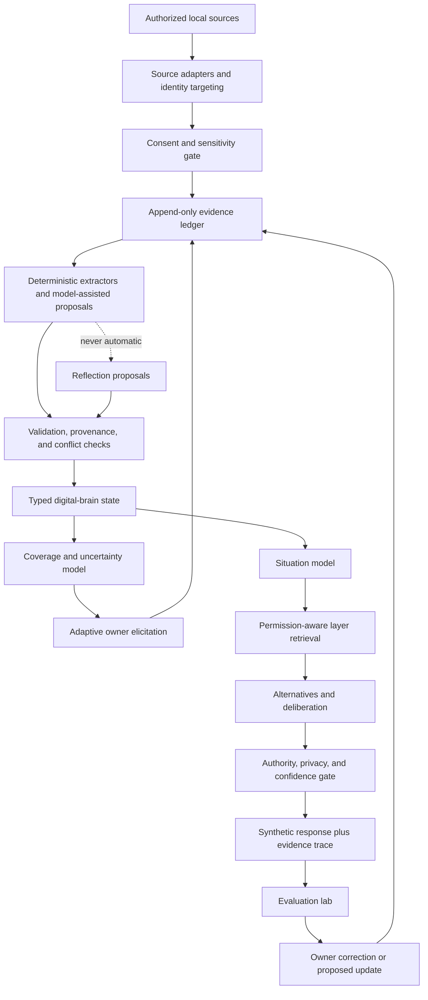

# Evidence-Grounded Digital Brain Synthesis

## Program Result

The council reviewed 200 seat records and reconciled 13 duplicate groups into
**187 unique primary papers**. All 187 records are independently cross-reviewed;
100 were inspected at full-text depth and 87 at abstract depth. The corpus spans
1975-2026, ten research seats, 31 controlled taxonomy tags, and 479 extracted
architecture implications.

The result supports a serious digital-self proof of concept. It does **not**
support a claim that a message archive reconstructs a complete person, that a
language model becomes the person, or that fluent roleplay proves behavioral
fidelity (`paper:psychometrics_fleeson_2001`,
`paper:synthetic-replacements-2024`, `paper:shopcart-human-behavior-2026`).

Machine-readable authority:

- `corpus.jsonl`: 187 deduplicated paper records
- `corpus-manifest.json`: hashes for contracts, all seats, all reviews, and corpus
- `corpus-report.json`: merge and duplicate report
- `corpus-summary.json`: deterministic coverage statistics
- `evidence-map.json`: 37 grounded program claims
- `contradictions.md`: 20 tensions that must remain visible
- `taxonomy.md`: state layers, observability, and update rules
- `elicitation-map.md`: WhatsApp gaps and adaptive owner questions
- `synthesis-drafts/`: ten cross-cutting specialist syntheses

## Bottom Line

Seven conclusions survive the full council:

1. **Observed interaction is evidence, not identity.** Language and behavior can
   predict bounded criteria, but topic, culture, role, audience, opportunity,
   state, and measurement error prevent direct promotion to a global self model
   (`paper:psychometrics_park_2015`, `paper:psychometrics_stachl_2020`,
   `paper:psychometrics_laajaj_2019`, `paper:psychometrics_sherman_2015`).
2. **A person cannot be represented by one vector or one prompt.** Episodic,
   semantic, procedural, prospective, self-schema, goal, affective, social, and
   narrative state have different evidence and update rules
   (`paper:cognitive-memory-vargha-khadem-1997`,
   `paper:cognitive-memory-cohen-squire-1980`,
   `paper:andersen-chen-2002-relational-self`,
   `paper:mcadams-et-al-2006-continuity-change`).
3. **Time and relationship are part of truth conditions.** A claim can be true in
   one period, role, relationship, audience, or channel and false or irrelevant in
   another without being a global contradiction (`paper:koren-2009-temporal-dynamics`,
   `paper:bell-1984-audience-design`, `paper:marwick-boyd-2011-context-collapse`).
4. **Memory must remain external, typed, source-linked, and editable.** Larger
   context windows and model weights do not provide reliable provenance,
   correction, temporal filtering, deletion, or long-horizon recall
   (`paper:locomo-2024`, `paper:longmemeval-2025`, `paper:memgpt-2023`,
   `paper:bourtoule-2021-machine-unlearning`).
5. **The owner is an authority, not merely another label source.** Owner
   declarations, corrections, scopes, revocations, and abstention preferences must
   be first-class, even when they reduce an automatic benchmark score
   (`paper:ahn-2007-open-user-profiles`,
   `paper:bakalov-2013-controllable-user-models`).
6. **Simulation requires deliberation and visible uncertainty.** The runtime must
   separate evidence, inference, assumption, alternatives, selected policy, and
   generated language; fluent confidence cannot stand in for evidence
   (`paper:linguistic-calibration-2022`, `paper:timechara-2024`,
   `paper:persona-dialogue-welleck-2019`).
7. **Fidelity is a vector with hard safety gates.** Style, persona adherence,
   memory, decisions, relationships, temporal behavior, owner judgment, privacy,
   and authority must be measured separately; severe leakage or unauthorized
   representation cannot be averaged away (`paper:charactereval-2024`,
   `paper:synthetic-replacements-2024`,
   `paper:carlini-2021-training-data-extraction`,
   `paper:mireshghallah-2024-confaide`).

## Evidence Status

The machine evidence map contains:

- **27 validated constraints:** direct reviewed evidence supports the bounded
  empirical statement.
- **7 plausible designs:** the component constraints are evidence-backed, but the
  integrated software design still requires comparative evaluation.
- **3 speculative non-goals:** complete WhatsApp reconstruction, latent-motive
  recovery, and autonomous/posthumous representation are unsupported.

“Validated” never means that a software architecture is biologically equivalent
to human cognition. Cognitive architectures and neural simulations model selected
tasks, not complete persons (`paper:cognitive-memory-anderson-et-al-2004`,
`paper:cognitive-memory-eliasmith-et-al-2012`).

## Target Architecture



The **canonical state is the ledger plus typed derived versions**, not the LLM,
prompt, embedding index, or style adapter. Those are replaceable computation and
retrieval surfaces. This follows from long-term memory failures, mutable user
state, source-monitoring requirements, and deletion obligations
(`paper:cognitive-memory-hashtroudi-johnson-chrosniak-1989`,
`paper:longmemeval-2025`, `paper:bourtoule-2021-machine-unlearning`).

## State Model

| Layer | Core objects | Required qualifiers | Why separate |
| --- | --- | --- | --- |
| Evidence | source event, owner interview answer, owner correction, consent event, tombstone | source/subject, observed time, content hash, sensitivity, scope, retention, directness | Prevent generated or third-party content from becoming owner identity (`paper:franz-2022-interdependent-privacy`, `paper:carlini-2021-training-data-extraction`) |
| Episodes | event claim, episode, general event, life period | event-time uncertainty, participants, sources, corroboration, conflict, owner status | Recall is reconstructive and source confidence is separable (`paper:libby-eibach-2002-looking-back`, `paper:cognitive-memory-hashtroudi-johnson-chrosniak-1989`) |
| Semantic | owner fact, self-knowledge, owner world knowledge | validity interval, evidence, confidence, supersession, relationship scope | Semantic and episodic knowledge can dissociate (`paper:cognitive-memory-vargha-khadem-1997`, `paper:haslam-et-al-2011-self-knowledge-identity`) |
| Procedural | habit, routine, strategy, trigger-action-outcome pattern | domain, trigger, exceptions, frequency, outcomes, owner confirmation | Repetition does not identify preference or motive (`paper:cognitive-memory-cohen-squire-1980`, `paper:rieskamp-otto-2006-strategy-selection`) |
| Prospective | intention, commitment, reminder, deadline | trigger, authority, status, completion evidence, expiry | Intention differs from execution and event-based cues differ from time monitoring (`paper:cognitive-memory-einstein-mcdaniel-1990`, `paper:cognitive-memory-einstein-et-al-2005`) |
| Self-schema | self-image, role, candidate trait, identity | owner/inferred, formation and retirement, contexts, counterexamples, protected status | Self-images can cue recall; state variation prevents timeless trait promotion (`paper:rathbone-moulin-conway-2008-self-centered`, `paper:psychometrics_fleeson_2001`) |
| Values and goals | value, aversion, durable goal, active goal, conflict | declared/observed/inferred, priority, scope, activation, evidence, outcome | Value structure, behavior, desire, conflict, and enactment are different constructs (`paper:bardi-schwartz-2003-values-behavior`, `paper:hofmann-2012-everyday-temptations`) |
| Decisions | decision episode, option, frame, reference point, policy hypothesis | domain, alternatives, constraints, selected action, outcome, rationale | Choice is frame- and option-set-dependent (`paper:tversky-kahneman-1981-framing`, `paper:tversky-simonson-1993-context-preferences`) |
| Affect | owner affect report, perceived expression, appraisal, tendency | time, intensity, mixture, directness, context, decay | Reader labels and expression are not felt emotion (`paper:trampe-2015-everyday-emotions`, `paper:demszky-2020-goemotions`) |
| Social | pseudonymous relationship, role, audience, common ground, disclosure rule | relationship, direction, audience, channel, purpose, third-party policy | Self-presentation and language are audience- and partner-conditioned (`paper:andersen-chen-2002-relational-self`, `paper:brennan-clark-1996-conceptual-pacts`) |
| Narrative | narrative version, theme, turning point, current meaning, perspective | episode links, telling time, audience, purpose, affect, coherence dimensions | Narrative meaning changes and coherence is not truth or health (`paper:jardmo-et-al-2023-repeated-narratives`, `paper:adler-2012-living-into-story`) |
| Communication | global baseline, relationship delta, channel policy, intent pattern | time, relationship, audience, discourse act, evidence volume | Style changes with partner and context; style is not identity (`paper:ireland-et-al-2011-language-style-matching`, `paper:bell-1984-audience-design`) |
| Epistemics | uncertainty, conflict, stale flag, support link, contradiction link, missing field | evidence quality, calibration class, last tested, abstention threshold | Correctness, source, and confidence must remain separate (`paper:linguistic-calibration-2022`, `paper:cognitive-memory-koriat-bjork-2005`) |
| Reflection | proposed update, consolidation, rejected inference, evaluation failure | inputs, policy/model version, diff, rationale, approval, replay hash | Generated reflection can help organize state but cannot become source evidence (`paper:generative-agents-2023`, `paper:cognitive-memory-hupbach-et-al-2007`) |

Every object carries provenance, confidence, temporal validity, sensitivity,
ownership, evidence-versus-inference status, and scope. A relationship-scoped item
is not globally contradictory until time and scope overlap.

## State Lifecycle

1. **Observe:** an authorized adapter emits normalized source events. Owner content
   and third-party context remain different targets.
2. **Propose:** deterministic extractors and optional providers emit candidate
   episodes, claims, procedures, goals, relationships, affect hypotheses, and
   narrative links. Generated material is marked as proposal.
3. **Validate:** schema, source, time, identity target, protected-trait, sensitivity,
   duplicate, and conflict checks run before any durable update.
4. **Consolidate:** repeated or related events may propose semantic/self-model
   updates. Rare counterexamples and old state are replayed before approval
   (`paper:cognitive-memory-mcclelland-mcnaughton-oreilly-1995`,
   `paper:lopez-paz-2017-gem`).
5. **Adjudicate:** low-risk deterministic changes may apply automatically under a
   visible policy; consequential inference, contradiction, or sensitive state asks
   the owner.
6. **Version:** accepted changes append a new version and supersession link. Nothing
   silently rewrites audit history.
7. **Forget or delete:** retrieval decay, suppression, archival, supersession,
   content deletion, and derived-artifact invalidation remain distinct operations
   (`paper:cognitive-memory-murre-dros-2015`,
   `paper:bourtoule-2021-machine-unlearning`).
8. **Replay:** rebuilding from the same evidence and deterministic policy must
   reproduce the same canonical state; provider-assisted proposals retain model,
   prompt, and response hashes.

## Architecture Decisions

| Decision | Selected | Rejected alternative | Evidence and rationale |
| --- | --- | --- | --- |
| Canonical identity | Typed external state plus evidence ledger | Model weights or one generated profile | Weights obscure source, correction, time, and deletion; long-memory systems still fail (`paper:longmemeval-2025`, `paper:bourtoule-2021-machine-unlearning`) |
| Storage | Layered records with graph links and search indexes | One vector store as the database | Functional distinctions, source monitoring, and scoped relationships require typed invariants (`paper:cognitive-memory-vargha-khadem-1997`, `paper:andersen-chen-2002-relational-self`) |
| Evidence | Append-only provenance with content deletion/tombstones | Mutable summaries as source truth | Recall and summaries are reconstructive; audit and revocation both matter (`paper:libby-eibach-2002-looking-back`, `paper:longpre-2024-consent-crisis`) |
| Updating | Propose, validate, version, supersede, replay | Silent continuous profile mutation | Preference drift and continual forgetting require time and regression checks (`paper:koren-2009-temporal-dynamics`, `paper:kirkpatrick-2017-ewc`) |
| Self model | Global owner state plus scoped selves | One globally consistent persona | Audience, role, and relationship legitimately change behavior (`paper:bell-1984-audience-design`, `paper:tice-et-al-1995-when-modesty-prevails`) |
| Retrieval | Authorization first, then per-layer temporal/scoped retrieval | Put all history in the context window | Long context misses evidence and increases exposure; privacy cannot be a post-prompt wish (`paper:locomo-2024`, `paper:mireshghallah-2024-confaide`) |
| Generation | Situation model, alternatives, trace, authority gate | One flat “act as me” prompt | Persona consistency does not establish owner fidelity or authority (`paper:incharacter-2024`, `paper:synthetic-replacements-2024`) |
| Fine-tuning | Optional, versioned style/policy adapter only after held-out stability | Put mutable facts, memories, or third-party text in parameters | Tuning complicates update, deletion, and leakage; retrieval remains inspectable (`paper:carlini-2021-training-data-extraction`, `paper:bourtoule-2021-machine-unlearning`) |
| Confidence | Evidence-class calibration and explicit abstention | Token probability or fluent assertiveness | Linguistic confidence can diverge from correctness (`paper:linguistic-calibration-2022`) |
| Evaluation | Multi-axis, prospective, owner-involved, hard safety gates | One replica, style, or persona score | Aggregate fit conceals individual and subgroup failures (`paper:out-of-one-many-2023`, `paper:synthetic-replacements-2024`) |
| Authority | Private simulation/drafting; no autonomous representation | Sending, promising, or acting as the person | Evidence does not confer agency, consent, or identity rights (`paper:brubaker-2016-legacy-contact`, `paper:lu-2026-griefbot-perceptions`) |

## Simulation Runtime

The runtime accepts an explicit scenario rather than an unbounded “be me” request:

```text
situation:
  actor, audience, relationship, role, intent, stakes,
  target_time, channel, authority, disclosure_scope

retrieval:
  episodes, semantic_self, procedures, goals_values,
  affect, relationship_state, narrative, communication_policy

deliberation:
  candidate_responses, evidence_for, evidence_against,
  assumptions, conflicts, missing_information, rejected_candidates

decision:
  selected_response, confidence_by_class, abstention_reasons,
  owner_question, authority_result, privacy_result
```

The trace distinguishes:

- **evidence:** direct authorized source or owner declaration
- **derived state:** validated versioned interpretation with source links
- **inference:** model or deterministic hypothesis not confirmed by the owner
- **assumption:** scenario detail supplied for this simulation only
- **generation choice:** language selected by the response model

Generated responses, inferred motives, and reflections are quarantined from the
evidence ledger. They can only create proposed updates. This prevents an early
hallucination from becoming later “memory” (`paper:generative-agents-2023`,
`paper:cognitive-memory-hupbach-et-al-2007`).

## Adaptive Owner Loop

The owner loop is not a static questionnaire. It uses the coverage model to ask
the smallest consequential question. Priority combines evidence gap, decision
impact, contradiction, staleness, owner request, sensitivity, and burden. Active
elicitation can improve bounded user models, but answerability and owner effort
matter (`paper:rashid-2008-information-theoretic-elicitation`,
`paper:harpale-2008-personalized-active-learning`).

Required order:

1. source consent, retention, revocation, and capability authority
2. relationship and disclosure boundaries
3. current high-impact goals, values, decisions, and contradictions
4. owner-authored life periods, self-images, and narrative versions
5. affect, communication, and lower-impact calibration

The owner can confirm, contextualize, supersede, contradict, decline, or revoke.
Prompt and order remain in provenance because elicitation can alter immediate
self-description (`paper:dargembeau-garcia-jimenez-2024-working-self`).

## Evaluation Lab

No single score passes the system. The lab reports a vector:

| Axis | Core tests | Required baselines or failure conditions |
| --- | --- | --- |
| Evidence grounding | citation correctness, source attribution, unsupported claim rate | no retrieval, lexical retrieval, oracle retrieval; wrong-source confidence is a failure |
| Behavioral | held-out response, choice, and prospective action prediction | demographics, recency, style-only, retrieval-only; report owner-level distributions |
| Temporal | as-of queries, supersession, preference drift, future leakage | static profile and all-time retrieval; later facts must not leak backward (`paper:timechara-2024`) |
| Relationship | style, role, common ground, and disclosure across held-out relationships | global-persona baseline; cross-relationship private leakage is a release blocker |
| Autobiographical | episode/source/meaning separation, period retrieval, competing versions | flat event search; repetition cannot count as factual truth |
| Values and decisions | frame, options, constraints, goals, counterfactual consistency | one global preference scalar; bare choice without context is incomplete |
| Affect and mental state | owner-report calibration, mixed affect, competing motive hypotheses | text classifier baseline; unconfirmed mind-reading is a failure |
| Calibration | reliability by evidence class, Brier-style error, abstention utility | fluent confidence and model probability; high-stakes unsupported output must abstain |
| Owner judgment | blinded pairwise utility, recognition, correction burden, trust calibration | automatic metrics remain separate; owner preference cannot waive privacy failures |
| Privacy and identity | extraction, membership, PII, sensitive inference, deletion, authority, impersonation | any severe private-text or unauthorized-representation failure blocks the capability |

Style similarity remains a diagnostic, not a fidelity score. Persona adherence can
increase while engagement, temporal stability, or real behavior remains wrong
(`paper:persona-dialogue-zhang-2018`,
`paper:personality-temporal-stability-2024`,
`paper:shopcart-human-behavior-2026`).

## Threat Model

Release-blocking threats include:

- private text or PII extraction (`paper:carlini-2021-training-data-extraction`,
  `paper:lukas-2023-pii-leakage`)
- protected or sensitive attribute promotion from behavior
  (`paper:kosinski-2013-private-traits`, `paper:gong-2016-attribute-inference`)
- cross-relationship or third-party disclosure
  (`paper:franz-2022-interdependent-privacy`,
  `paper:marwick-boyd-2011-context-collapse`)
- future knowledge leaking into historical simulation (`paper:timechara-2024`)
- generated output writing back as owner evidence
- revoked evidence persisting in summaries, embeddings, replay, adapters, or exports
  (`paper:bourtoule-2021-machine-unlearning`)
- unlabeled first-person impersonation, autonomous commitments, or posthumous use
  without an explicit governance regime (`paper:brubaker-2016-legacy-contact`,
  `paper:lu-2026-griefbot-perceptions`)

Local-first operation reduces exposure but does not eliminate misuse, shared-device
risk, unsafe exports, or model memorization. Privacy is enforced before retrieval,
again before output, and after deletion through adversarial verification.

## Proof-Of-Concept Sequence

### Phase 1: State Foundation

- implement the `digital_brain.v2` typed model and migration from `digital_self.v1`
- preserve existing source adapters and evidence hashes
- add scopes, validity, sensitivity, ownership, conflicts, and correction
- build deterministic serialization, validation, temporal queries, and inspection

### Phase 2: Consolidation And Reflection

- group source events into proposed episodes
- propose semantic, procedural, self-schema, value/goal, social, and narrative state
- emit reflection diffs with rejected inferences and replay hashes
- support correction, supersession, decay, content deletion, and rebuild

### Phase 3: Deliberative Simulation

- construct the situation model
- perform permission-aware retrieval by layer
- generate alternatives and a structured trace
- enforce high-stakes, privacy, confidence, and authority abstention
- support deterministic test providers and optional LLM providers

### Phase 4: Guided Experience And Evaluation

- one local guided workflow for source selection, coverage, interview, build,
  inspect/correct, simulate, and evaluate
- a synthetic demo fixture with no private data or external model dependency
- owner-visible coverage, blind spots, next questions, versions, and traces
- multi-axis benchmark and release-blocking privacy/identity gates

## Explicit Non-Goals

- consciousness, personhood, or cognitive equivalence
- mental-health diagnosis or protected-trait inference
- a complete personality decoded from messages
- deceptive impersonation or unlabeled first-person output
- autonomous sending, commitments, transactions, or representation
- posthumous deployment without a separate consent and stewardship program

## Open Research Questions

1. How much owner evidence is needed for reliable state distributions within each
   relationship, and how should reliability be normalized across owners?
2. Which layered memory topology improves owner-level outcomes over simpler
   retrieval without increasing correction burden or leakage?
3. Can prospective owner questions distinguish stable values from norms, habits,
   and temporary goals at acceptable burden?
4. How should event identity be matched across changed dates, details, audiences,
   and meanings without collapsing distinct events?
5. Which confidence thresholds optimize usefulness while preserving high-stakes
   abstention and owner trust calibration?
6. How should deletion propagate through derived state, embeddings, replay,
   optional adapters, reports, and released simulations?
7. What prospective owner-level evaluation distinguishes useful simulation from
   style mimicry, population averaging, and memorization?

## Final Claim

The evidence supports building an **inspectable owner-governed digital-self
simulator**, not claiming a replicated human. Its value comes from preserving
partial evidence, context, change, contradiction, and uncertainty more faithfully
than a flat persona prompt. Its credibility must come from prospective owner-level
evaluation and hard privacy/authority controls, not from the fluency of its voice.
